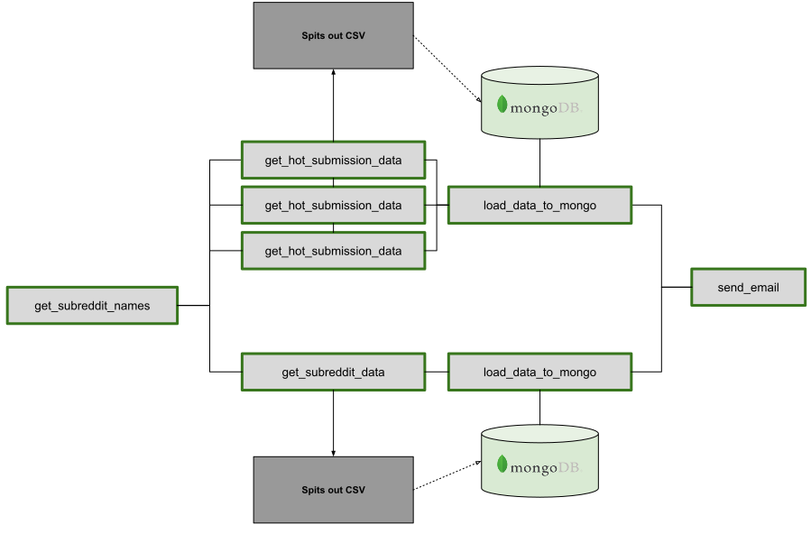
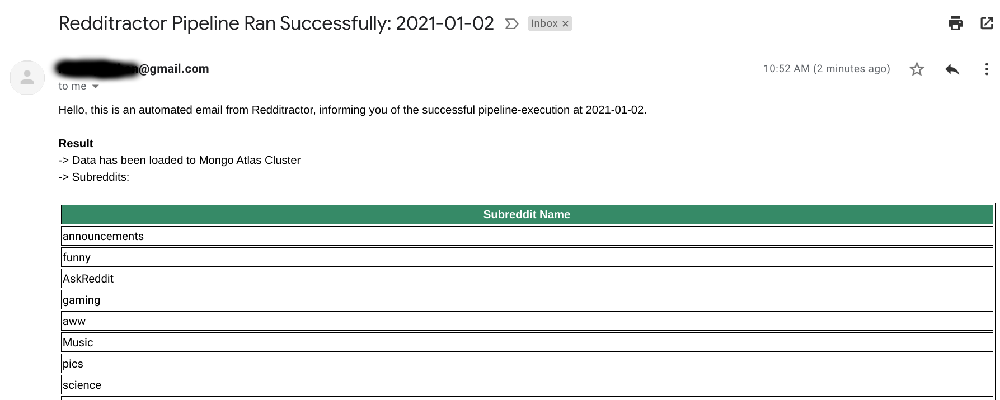

# redditract-pipeline

## 1.Introduction & Motivation
---

### Introduction
A simple Airflow ETL pipeline written in Python to gather various data on Reddit's top 100 subreddits.
Reddit API & its Python client "PRAW" are used for data retrieval.

### Motivation:
- Build simple ETL system as my personal fun project
- Demonstrate basic skills and workflow in Airflow which involves data retrieval from an API service


<p align="center">
  
</p>

## ***Task Flow***
1. Get the names of top 100 subreddits
2. Get details and data on each subreddit via Reddit API
3. Get hot/new/top submissions for each subreddit via Reddit API
4. Load retrieved data to MongoDB
5. Send Email report informing the successful DAG run

<br>


<br>

---
## 2.Airflow Variables

In order for the pipeline to work properly, the following Airflow variables are required.

<br>

### Mongo DB: ```mongo_uri```
URI for Mongo DB. Retrieved data will be stored in the specified Mongo DB.

<br>

### Reddit Credentials: ```reddit_credentials```
Credentials for Reddit API. The pipeline assumes the following structure for ```reddit_credentials```
```json

{
    "reddit_credentials": {
        "reddit_key": YOUR_REDDIT_KEY,
        "reddit_secret": YOUR_REDDIT_SECRET
    }
}
```

<br>

### Email Configuration: ```EMAIL_SENDER & EMAIL_RECEIVER```
The pipeline is configured to send an email with result summary after each successful DAG run.
The following variables are required for it to work:
```email_sender```: Email to send notifiactions from
```email_receiver```: Email to send notifications to

Here is the sample of email report.

<p align="center">
  
</p>

---
## 3.Deployment

Docker containers are used for deployment.(```puckel/docker-airflow:1.10.9```)
Deployment is as easy as performing ```docker-compose up``` in the terminal.
